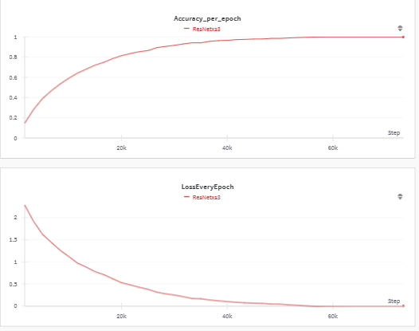

# Deep-Learning-CIFAR10-pytorch
This repository implemts a baseline convolutional neural network, few techniques to improve its accuracy, along with implemention of ResNet, ResNeXt and DenseNet architectures.

<!-- ABOUT THE PROJECT -->
## About The Project

In this repo, I have trained a baseline convolutional neural
network, implemented techniques to improve its accuracy, and
implemented ResNet, ResNeXt and DenseNet architectures.
For each model, I present details on the training and testing
accuracy over batch and epochs, loss over batch and epoch,
number of parameters, model architecture, and confusion
matrices. Finally, I provide a comparison of all the models
on key metrics.

Baseline Network           | ResNet Network           | ResNext Network           |  DenseNet Network
:-------------------------:|:-------------------------: |:-------------------------: |:-------------------------: 
 |  |  |  
 |  |  | 

## Comparison and Analysis
* Training and Test Accuracy for Different Models:
    *  The models demonstrate high training accuracy, indicating effec-
tive learning during training. The data shown in 36 is the best
performed model for individual architecture. Test accuracy
reveals varying performance, with DenseNet achieving the
highest at 82.06%, surpassing ResNeXt and ResNet. ResNet
and ResNeXt show competitive test accuracies, highlighting
their efficacy for image classification tasks. The baseline model lags in test accuracy compared to the more complex
architectures but still achieves reasonable performance.

* Model size and number of parameters for Different Models:
    * The models size and number of parmaters are com-
pared in the 37. The analysis of the model characteristics
reveals distinct trade-offs between size and complexity. The
baseline model, with a modest size of 0.49 MB and only 10
parameters, showcases efficiency in terms of both memory
footprint and model simplicity. In contrast, the ResNeXt
model, while significantly larger at 37.487 MB, achieves a
higher level of complexity with 188 parameters, illustrating the
inherent compromise between model size and expressiveness.
The ResNet model strikes a balance with a moderate size of
87.34 MB and 122 parameters. DenseNet, with 27.74 MB
and 722 parameters, reflects the challenge of maintaining a
compact model size while accommodating a more intricate
architecture. Overall, the analysis underscores the need to
consider both model size and parameter count in selecting an
optimal model for a given application.

* Accuracy trend over epochs :
    * The shown results in 
suggest a delicate balance between underfitting and overfitting
during the model training process. Models trained for 20, 30,
and 40 epochs exhibit competitive test accuracies, indicating
a sweet spot for generalization. However, the decline in
accuracy for models trained for 55, 70, and 95 epochs suggests
overfitting, where the models start memorizing the training
data excessively. This underscores the importance of optimal
epoch selection to achieve a well-generalized model without
succumbing to the pitfalls of underfitting or overfitting. The
findings emphasize the need for a nuanced understanding of
the trade-off between model complexity and generalization
performance in machine learning.

## Run the Code:

1. Execute the Phase 2 training code by running the following command:
cd Phase2/Code
python3 .\Train.py

2. Execute the Phase 2 test code by running the following command:
cd Phase2/Code
python3 .\Test.py

## View Results:

The results 
1. Trained models are stored in the "models" directory.
2. Results of all the models representing different graphs, network structures and comparison graphs are stored in the "results" directory.
3. Default model for testing is kept as basline model "20mines3w.ckpt".  
